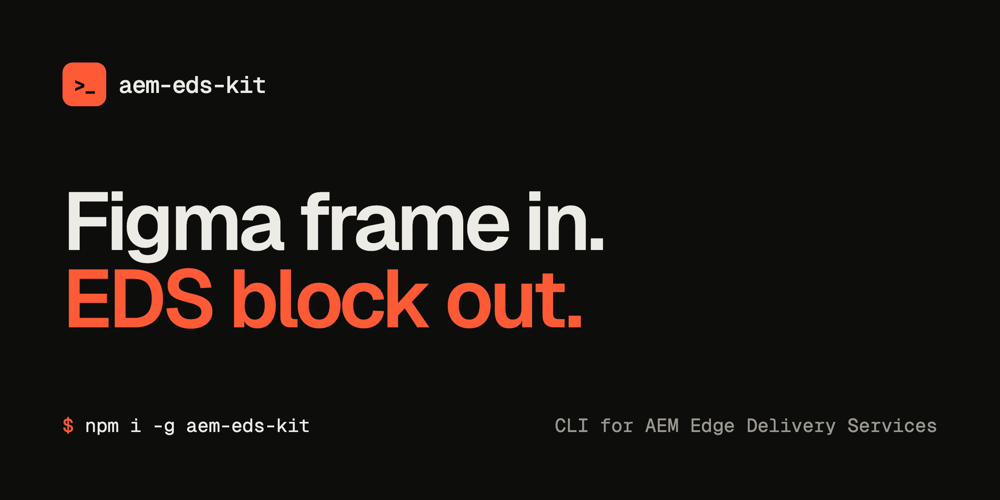

<p align="center"></p>

# aem-eds-kit

[](https://www.npmjs.com/package/aem-eds-kit)
[](https://www.npmjs.com/package/aem-eds-kit)
[](https://github.com/piotrgodycki/aem-eds-kit/actions/workflows/ci.yml)
[](LICENSE)
[](https://nodejs.org)

**Turn a Figma frame into an EDS block** - JS, CSS and a Universal Editor model - without leaving your terminal.

`aem-eds-kit` gives you the `eds` command. Paste a Figma link and it hands the design to the AI agent you already use (Claude Code, Cursor or Codex); the agent reads it through Figma MCP and writes production-ready code straight into your repo. It also scaffolds blocks, previews them in your browser, and keeps your project healthy with a few quick audits.

It lives next to `@adobe/aem-cli` (your local dev server) and handles everything around it.

## Install

```bash
npm install -g aem-eds-kit
```

Node.js 20 or newer. That's all the setup there is - `eds` now works in **any folder**. Step into your EDS project (anywhere with a `fstab.yaml`) and the CLI finds the project root for you:

```bash
cd ~/my-eds-site
eds figma setup                              # one-time: connect your AI agent to Figma
eds block from-figma "<figma-url>" --name hero
```

`eds` runs on your machine, not on your site - it never adds a single byte to what your visitors download.

## Interactive mode

Run `eds` with no command and it opens an **interactive menu** that walks you through every feature (generate from Figma, scaffold, create a block, add an integration, preview, Admin API, audits, Figma setup). Most commands are also interactive on their own when you omit arguments - e.g. `eds block from-figma` (wizard), `eds scaffold`, `eds integrate`, `eds preview`. Flags and subcommands still work for CI / power users.

A full A-Z reference of every command lives on the docs page: **https://piotrgodycki.github.io/aem-eds-kit/docs.html**

## Quick start

```bash
eds                              # interactive menu

# One-time: configure Figma MCP for your AI agent
eds figma setup

# Generate a block from a Figma design (wizard, or pass a URL)
eds block from-figma

# Scaffold the standard UE components + blocks
eds scaffold ue
eds scaffold blocks

# Add a third-party service (GTM, GA4, chat…)
eds integrate

# Audit your project
eds doctor
```

## Commands

### `eds block create <name>`

Scaffolds `blocks/<name>/` with `<name>.js`, `<name>.css`, **and a Universal Editor model `_<name>.json` by default** - so the block is authorable in UE the moment it's created. Validates kebab-case naming and checks for collisions.

```bash
eds block create hero-banner             # js + css + _hero-banner.json (UE model)
eds block create hero-banner --no-ue-model   # skip the UE model
```

The generated `_<name>.json` uses the EDS block-plugin (xwalk) format (`definitions` / `models` / `filters`) with starter fields (title + heading-level select + rich text). Extend it from the **full catalog of all 17 Universal Editor field types** - see [`docs/universal-editor-fields.md`](docs/universal-editor-fields.md). `eds block from-figma` picks the right field type per Figma layer automatically.

### `eds block from-figma [figma-url]`

Translates a Figma frame into an EDS block. Run with **no URL** for a step-by-step wizard (name, link, content source, UE model, screenshot, run mode). It builds a prompt with EDS conventions + your project's design tokens and hands it to your AI agent (Claude Code, Cursor, or Codex).

The agent reads the design through Figma MCP (`get_design_context`, `get_variable_defs`, `get_screenshot`), **downloads referenced assets into the repo**, generates pixel-perfect code (JS + CSS) **and its Universal Editor model** by default, then self-verifies. You see a **live, colour-coded log** with per-phase timings, and on success the **live preview starts automatically**.

```bash
eds block from-figma                               # interactive wizard
eds block from-figma "<figma-url>" --name hero     # non-interactive
eds block from-figma "<figma-url>" --dry-run       # just build the prompt
```

| Flag | Description |
|---|---|
| `--name <name>` | Override the inferred block name |
| `--source <type>` | Content source: `document` \| `ue` \| `cf` \| `mixed` |
| `--agent <type>` | Force `claude` \| `cursor` \| `codex` \| `none` |
| `--dry-run` | Build the prompt only |
| `--no-ue-model` | Skip the Universal Editor model |
| `--no-screenshot` | Skip the screenshot (fewer tokens; structural verification) |
| `--no-serve` | Don't auto-start the live preview |
| `--yes` | Skip confirmation prompts |

**Supported Figma URL formats:**
- `figma.com/design/:fileKey/:name?node-id=...`
- `figma.com/file/:fileKey/:name?node-id=...` (legacy)
- `figma.com/design/:fileKey/branch/:branchKey/:name` (branches)
- `figma.com/board/...`, `figma.com/make/...`, `figma.com/slides/...`

### `eds figma setup`

Interactive wizard that:
1. Detects installed AI agents (Claude Code, Cursor, Codex)
2. Checks if Figma MCP is configured for your agent
3. Shows install commands if not
4. Saves preferences to `~/.eds/config.json`

### `eds block list`

Lists all blocks in the project with their file status and Figma source info.

```bash
eds block list
eds block list --json          # machine-readable output
```

### `eds block preview <name>`

Serves a **live, breakpoint-switchable preview** of a block in your browser - no build, no files written to your project (the harness is served from memory). A dropdown switches widths inside an iframe, and **edits live-reload** the browser (the server watches the block folder).

```bash
eds block preview hero
eds block preview hero --widths 375,768,1280   # custom breakpoints
eds block preview hero --port 9000 --no-open
```

### `eds scaffold ue` · `eds scaffold blocks`

Scaffold Universal Editor components deterministically (no agent). `eds scaffold ue` writes/merges the three UE config files with the default-content components and a **`field-reference` block showing all 17 field types** + a multifield. `eds scaffold blocks` scaffolds standard Block Collection blocks (hero, cards, columns, accordion, embed) with UE models. Run `eds scaffold` for an interactive picker.

```bash
eds scaffold ue
eds scaffold blocks            # all, or: eds scaffold blocks hero cards
```

### `eds integrate [type]`

Add a third-party service to `scripts/delayed.js` (the EDS-correct place - delayed phase, after LCP, zero CWV impact). Chat widgets use the facade pattern.

```bash
eds integrate                  # interactive
eds integrate gtm              # gtm · ga4 · chat · cookiebot · custom
```

- A dropdown switches the block between breakpoints inside an `<iframe>`, so the block's media queries fire against the chosen width - a **width-honest** comparison that isn't distorted by your monitor size.
- Breakpoints come from the block's `.eds-meta.json` (`breakpoints`, marking which widths have a real Figma frame → pixel-perfect) and fall back to `375 / 768 / 1280` or `--widths`.
- If the block has a `.eds-meta.json` with a Figma source, an **Open in Figma** link is shown.
- Authored sample content is read from `blocks/<name>/_<name>.preview.html` if present; otherwise a placeholder is used (and the chrome tells you to add one).

> Not to be confused with `eds preview <paths...>` (lower down), which previews **pages** via the AEM Admin API.

### `eds preview <path...>`

Preview pages via the AEM Admin API (`admin.hlx.page`).

```bash
eds preview /index
eds preview /blog/my-post /about
eds preview /index --org my-org --site my-repo --ref main
```

### `eds publish <path...>`

Publish pages to live via the AEM Admin API.

```bash
eds publish /index
eds publish /blog/my-post /about
```

Both `preview` and `publish` read `org`, `site`, and `ref` from `.edsrc.json` so you don't need to pass flags every time:

```json
{
  "admin": {
    "org": "my-github-org",
    "site": "my-repo",
    "ref": "main"
  }
}
```

### `eds doctor`

Audits your EDS project for common issues:
- `fstab.yaml` exists and is valid YAML
- `head.html` present
- Every block folder has a matching `.js` file
- Every block has a Universal Editor model (`_<name>.json` or an entry in `component-models.json`)
- No `console.log` in block code
- `helix-query.yaml` valid if present
- Figma-generated blocks: warns if last sync > 30 days
- CLI config present

```bash
eds doctor
eds doctor --json
```

### `eds audit loading`

Audits the EDS three-phase loading strategy and LCP budget:
- No render-blocking scripts / extra stylesheets / preload-preconnect / font preloads in `head.html`
- `scripts.js` has `loadEager` / `loadLazy` / `loadDelayed`; eager phase loads only the first section
- `styles.css` within the LCP budget; no `@import` chains
- No heavy libraries (`jquery`, `gsap`, `swiper`, …) or `document.write` in blocks
- Block CSS is scoped to `.<block-name>` (prevents style leakage / CLS)

```bash
eds audit loading
eds audit loading --json
```

### `eds audit security`

Scans the project for **vulnerabilities** and **exploit patterns** - a defensive check you can run before every PR or in CI.

- **Dependency vulnerabilities** - runs `npm audit` and summarizes critical/high/moderate/low (skipped gracefully if there's no `package.json`/lockfile).
- **Exploit scan** - static analysis of `blocks/`, `scripts/`, and HTML for:
  - `eval()`, `new Function()`, `document.write()` - code-execution vectors
  - dynamic `innerHTML` / `insertAdjacentHTML` / `javascript:` URLs - XSS
  - hardcoded secrets, AWS keys, private keys, bearer tokens
  - `http://` resources (mixed content), `target="_blank"` without `rel="noopener"` (reverse tabnabbing)
  - `postMessage('*')`, inline event handlers, leftover `console.log`

Findings are grouped by severity (CRIT / HIGH / MOD / LOW). Exits non-zero if any **critical or high** issue is found - wire it straight into CI.

```bash
eds audit security
eds audit security --json      # for CI / tooling
```

The vendored framework (`scripts/aem.js` / `lib-franklin.js`) is never flagged.

## How Figma integration works

You don't need a Figma API token. `aem-eds-kit` never talks to Figma directly - it writes a focused prompt and hands it to the AI agent you already use, which has its own Figma MCP connection. The agent reads the design and writes the files; `eds` orchestrates the handoff and checks the result.

```
┌──────────┐     prompt      ┌─────────────┐    MCP calls    ┌───────────┐
│  eds-cli │ ──────────────→ │ Claude Code │ ──────────────→ │ Figma MCP │
│          │                 │ / Cursor    │ ←────────────── │  Server   │
│          │ ←────────────── │ / Codex     │   design data   └───────────┘
│          │   block files   └─────────────┘
└──────────┘
```

The prompt includes:
- Figma file key and node ID to fetch
- EDS block conventions (`decorate(block)`, vanilla JS, semantic HTML, full-width/mobile-first)
- CSS custom properties from your `styles/styles.css`
- Universal Editor model generation (fields mapped from Figma layers/variants) - on by default
- Lighthouse performance requirements + pixel-perfect self-verification
- Output file structure

## Configuration

Priority: CLI flags → env vars → `.edsrc.json` (project) → `~/.eds/config.json` (global)

**`~/.eds/config.json`** (created by `eds figma setup`):
```json
{
  "agent": "claude"
}
```

**`.edsrc.json`** (project root, optional):
```json
{
  "admin": {
    "org": "my-org",
    "site": "my-site",
    "ref": "main"
  }
}
```

## Global flags

| Flag | Description |
|---|---|
| `--verbose` | Debug-level output |
| `--quiet` | Errors only |
| `--json` | Machine-readable JSON output |
| `--no-color` | Disable colors (also respects `NO_COLOR` env) |

## Development

```bash
git clone <repo-url> && cd eds-cli
npm install
```

### Scripts

```bash
npm run dev -- --help          # run via tsx, no build needed
npm run build                  # build to dist/
npm test                       # vitest
npm run typecheck              # tsc --noEmit
npm run lint                   # biome check
npm run lint:fix               # biome auto-fix
```

### Testing locally

**Option A - global link (recommended):**

```bash
npm run build && npm link
eds --help                     # available everywhere
```

After code changes, re-run `npm run build` to update.

**Option B - dev mode (no build):**

```bash
npm run dev -- doctor
npm run dev -- block create my-block
npm run dev -- block from-figma "https://www.figma.com/design/abc/File?node-id=1-2" --dry-run
```

**Option C - run from a test EDS project:**

The repo includes a fixture project you can use:

```bash
cd tests/fixtures/sample-eds-project

# with global link
eds doctor
eds block create my-block
eds block from-figma "https://www.figma.com/design/abc/File?node-id=1-2" --dry-run --name hero

# without link
npx tsx ../../../src/bin/eds.ts doctor
```

### Testing Figma integration (dry-run)

You don't need a real Figma file to test prompt generation:

```bash
eds block from-figma "https://www.figma.com/design/abc123/Test?node-id=42-100" \
  --dry-run --name hero-banner
```

This parses the URL, builds the full agent prompt (with project tokens, EDS conventions), saves it to a temp file, and prints it. No agent or Figma access needed.

### Running tests

```bash
npm test                       # run all tests once
npm run test:watch             # watch mode
```

Tests use fixtures in `tests/fixtures/` - a sample EDS project and recorded Figma MCP responses.

## Roadmap

- **v0.2** - `eds figma pull-tokens` (Figma variables → CSS custom properties), `eds block from-figma --update` (incremental sync), `eds lighthouse`
- **v0.3** - Headless mode (`--headless`) - direct Figma MCP client via `@modelcontextprotocol/sdk`, no agent needed. For CI/CD.
- **v0.4** - Figma Code Connect integration, `eds rum`, `eds migrate page`

## Trademarks & affiliation

`aem-eds-kit` is an independent, community project. It is **not affiliated with, endorsed by, or sponsored by Adobe or Figma.** It ships none of their code - it only generates code that follows the public, open-source AEM Edge Delivery Services conventions and interoperates with tools you install yourself.

Adobe, AEM, Edge Delivery Services and Universal Editor are trademarks of Adobe Inc. Figma is a trademark of Figma, Inc. These names are used only to describe compatibility.

## License

MIT - see [LICENSE](LICENSE).
